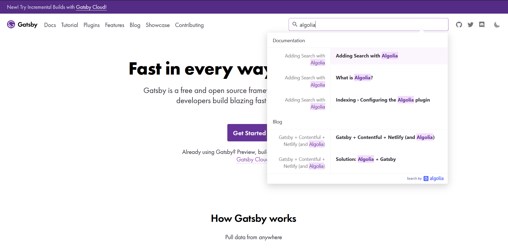

# Adding Search to a Gatsby Site with Algolia



To add search functionality to a Gatsby site you need three things:

1. A Search Index

2. A Search Engine

3. Search UI

A search index stores information about your site in a way that the search engine can efficiently read without having to scan every page of your site.

A search engine is a programme that takes a search query, checks it against the search index and returns matches.

The UI components let the user make search queries and view search results.

You could incorporate an open source search engine into your site (which every user will have to download) or use an API-based search engine (which is more scalable but can be costly).

## Algolia

[Algolia](https://www.algolia.com/) is a service which hosts search indices and a search engine, which are accessible via an API. They also provide components for building the search UI.

[`gatsby-plugin-algolia`](https://github.com/algolia/gatsby-plugin-algolia) creates an index of your site's pages at build time. You can use GraphQl to control which pages and what information are included. This index is then stored by Algolia and accessible for future searches.

Gatsby have an excellent [tutorial for adding Algolia to a Gatsby site](https://www.gatsbyjs.org/docs/adding-search-with-algolia/).

## Gatsby and Algolia

This project use `gatsby-plugin-algolia` to generate the search index.

`src/utils/algolia-queries.js` configures the plugin, telling it which information to index. In this case the slug, `excerpt` field, and frontmatter `title` field from the Markdown blogposts.

## Run this project locally

Clone this respository.

```
git clone git@github.com:GK-Hynes/100-days-of-gatsby.git
```

Switch into the gatsby-algolia-search directory.

```
cd 100-days-of-gatsby/gatsby-algolia-search
```

Install the necessary packages.

```
npm install
```

In `gatsby-config.js`, replace the Algolia API keys with your own. You can get these by [signing up at algolia.com](https://www.algolia.com/users/sign_up) and then going to the "API Keys" section of you Algolia profile.

```
{
  resolve: `gatsby-plugin-algolia`,
  options: {
    appId: process.env.GATSBY_ALGOLIA_APP_ID,
    apiKey: process.env.ALGOLIA_ADMIN_KEY,
    queries: require("./src/utils/algolia-queries"),
  },
},
```

It's advisable to store these as environmental variables in a `.env` file.
